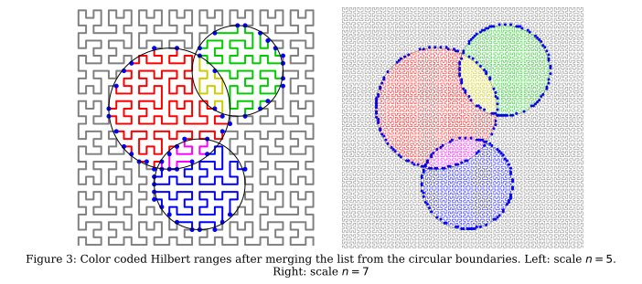

# hilbert-trees-model
Plotting routines for Hilbert curve based huge tree model integration paper.

TODO - clean up this readme!

This is the python and matplotlib code to produce the figure for (futurelink).
for example 

### Issues
Parts of this code were ported from Ocaml and C++ with the purpose
of producing the correct figures. It is not intended to be nice
portable and reusable code! (Maybe at some point I'll port the core
concepts to a nice opensource library, but not today.)

A 2D location is encoded either at (X,Y,1\<\<W) with X, Y, and Z
as integers, or as a float pair (x,y) with x and y in the range
(-1,1).  A 1D curve index is encoded as either (I, 1<\<\N) or a
float in the range [0,1).  In all cases these are dyadic fractions.
In C++, moving between the two is trivial as it's really just how
the structre is packed, and format is needed can be inferred from
the context. In python, well, not so much. Python really wants me to
pick a lane, and I really ought to tidy that up.

